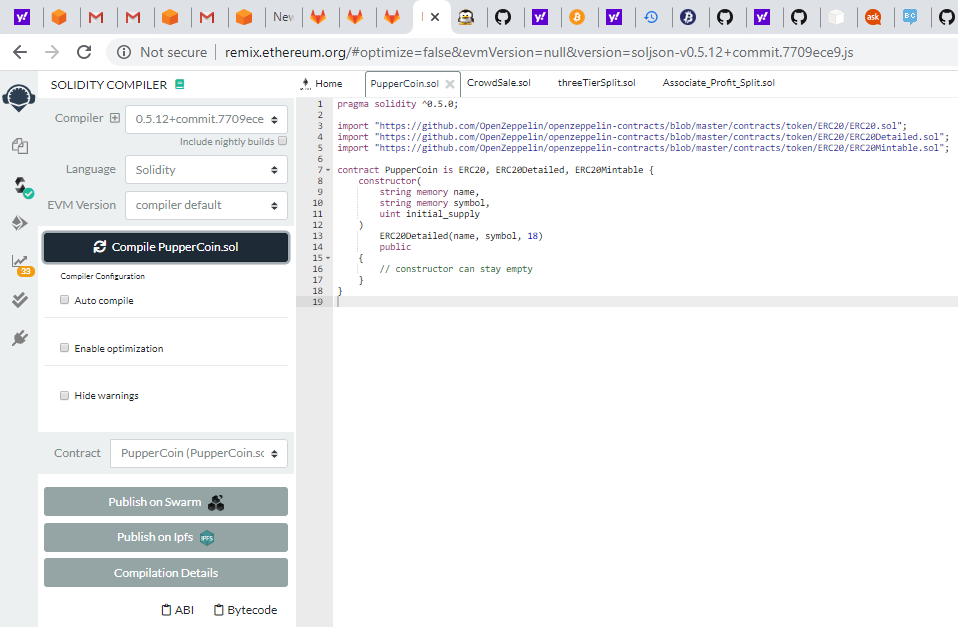
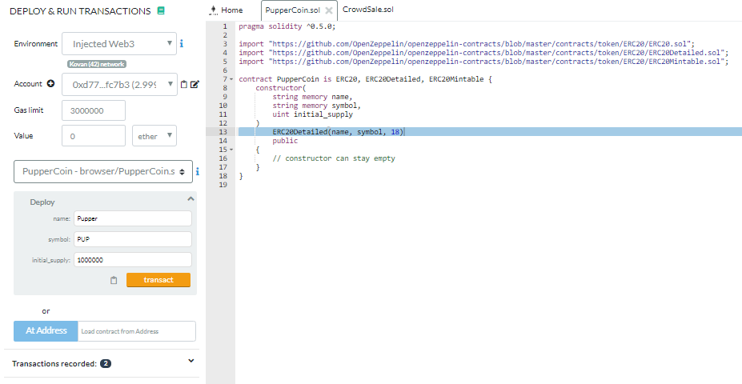
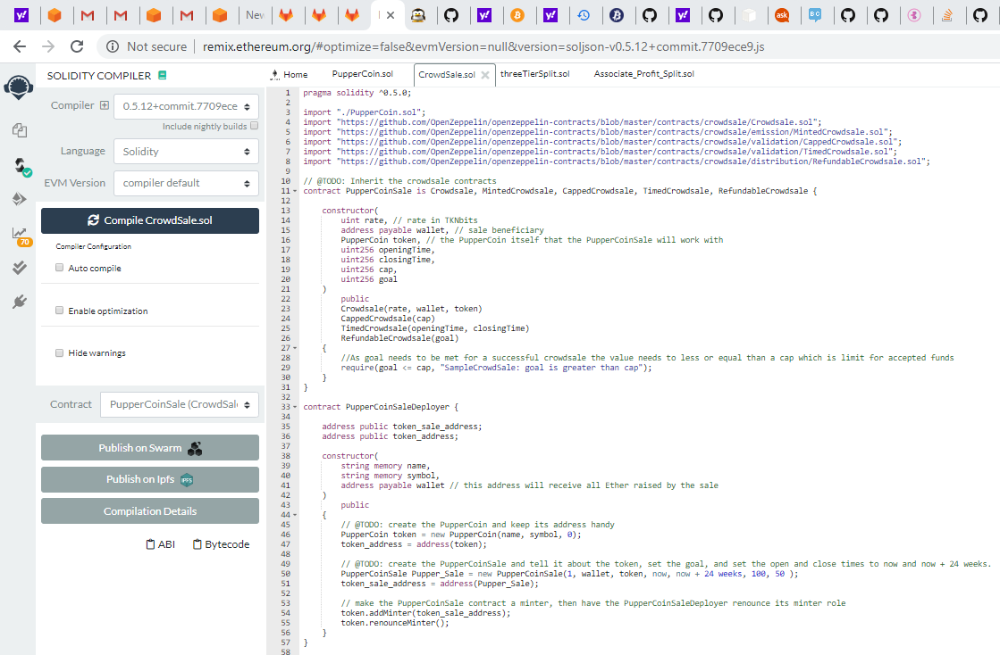
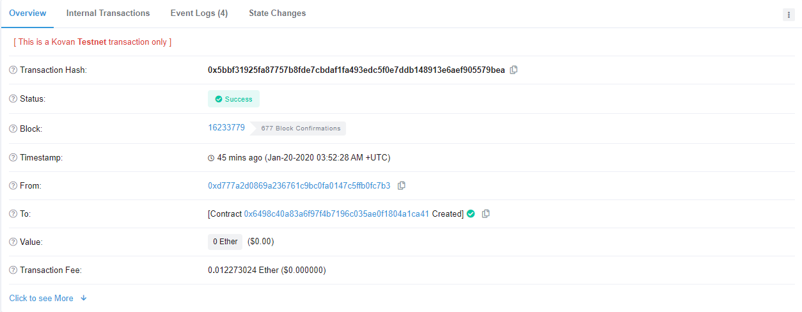
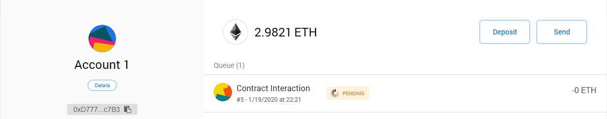

# Week 20 HW - Pupper Crowd Sale

* Name: *Vinay Kakuru*
* Assignment: *Solidity - Week 21*
* Summary: *Purpose of this assignment is to create a new Pupper token and release for crowd sales on Kovan Network*
##
    * Token Name: PupperCoin
    * Token Symbol: PUP
    * Rate : 1 Ether = 1 PUP
    * Goal: 50 Ether
    * Cap: 100 Ether
    * Closing: July 5th, 2020
    * Contract Address: 0x6498c40a83a6f97f4b7196c035ae0f1804a1ca41

Tokens can be purchased by sending Ether to the `above contract address` on Kovan Network 

### Confirmation of CrowdSale Contract Deployment https://kovan.etherscan.io/tx/0x5bbf31925fa87757b8fde7cbdaf1fa493edc5f0e7ddb148913e6aef905579bea

## My Steps and Screen-Shots

1) Compile PupperCoin.SOL
   

2) Deploy PupperCoin.SOL
   

3) Compile CrowdSale.SOL
   

4) Deploy CrowdSale and Get Contract Address
   

5) Buy PupperCoin on Kovan Network
   
